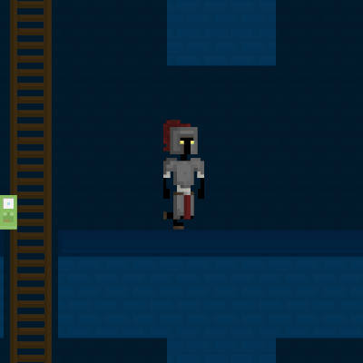

# SDL2 Dungeon Game
This repository contains the code of my first attempt at writing a game. The original idea was to create an endless randomly generated dungeon crawler, however, I never got to actually finish it.

I'm leaving the source here purely for reference and do no longer intend to work on this project.

## Music
The music used in this project (found in the './assets' folder, converted to WAV files) was made by Eric Matyas. You can find his work on his website: https://soundimage.org/.
